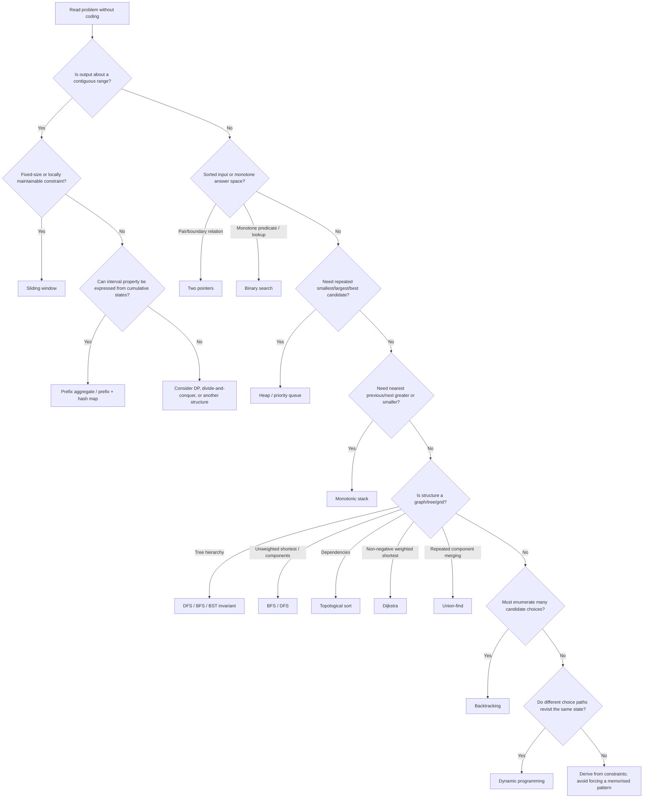
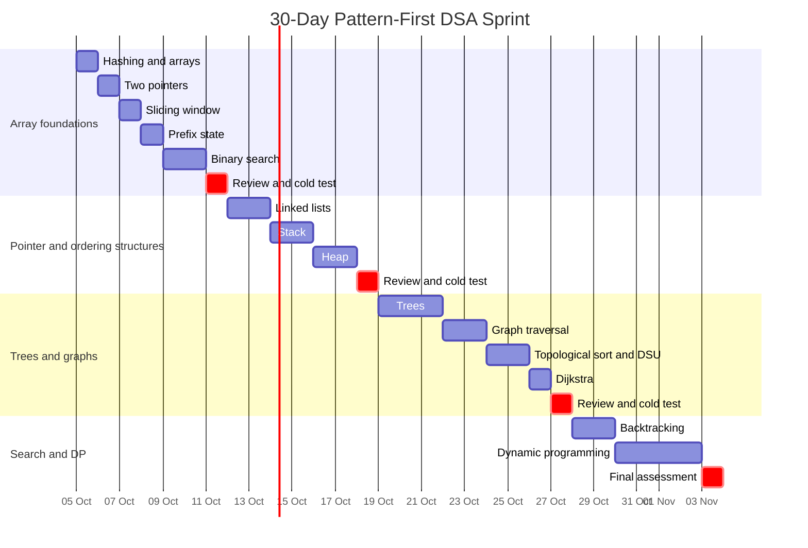

# One-Month Pattern-First DSA Mastery Plan

## Executive summary

Your proposed learning model is sound: **learn DSA as a collection of reusable computational patterns, not as a linear syllabus**. The important distinction is that you are trying to build two separate abilities:

> **Recognition:** “What structure does this problem have, and what pattern is likely to exploit it?”  
> **Execution:** “Once I choose the pattern, can I implement the machinery without spending working memory on syntax or boilerplate?”

This is also a sensible way to compress interview preparation. MIT's introductory algorithms curriculum explicitly separates elementary data structures such as arrays, heaps, trees and hash tables from algorithmic approaches such as graph search and dynamic programming, while Princeton's *Algorithms* materials similarly organise around reusable abstractions—priority queues, symbol tables, trees, graphs and graph-processing algorithms. citeturn0search7turn7search0

A month is aggressive. LeetCode itself describes its 75-problem plan as suitable for roughly **one to three months**, while its 150-problem interview plan is positioned for **three or more months**; its dedicated binary-search plan alone contains eight patterns and 42 questions. The implication is that the right one-month objective is **high fluency in the highest-yield primitives and recognition rules**, not encyclopaedic coverage of every algorithm. citeturn0search1turn7search4turn7search5

The plan below therefore prioritises about two dozen pattern families across your requested topics:

| Area | Highest-priority pattern families |
|---|---|
| Arrays | Two pointers, sliding window, prefix aggregates, binary search, interval processing |
| Hash maps | Lookup/frequency/grouping, prefix-state indexing |
| Linked lists | Reversal/rewiring, fast-slow/fixed-gap pointers, dummy-node construction |
| Stacks | Matching/evaluation, monotonic stack |
| Heaps | Top-K/bounded heap, K-way merge, scheduling/streaming order statistics |
| Trees | DFS/BFS traversal, subtree aggregation, BST ordering |
| Graphs | DFS/BFS/components, multi-source BFS, topological sort, Dijkstra, union-find |
| Backtracking | Subset/permutation/combination generation, constraint search and partitioning |
| DP | One-dimensional state DP, knapsack/subset DP, grid DP, string/sequence DP |

DP and backtracking are algorithmic paradigms rather than literal data structures, but they belong in the plan because they represent major families of reusable problem-solving machinery. MIT's algorithms curriculum likewise treats dynamic programming as an algorithmic approach alongside its treatment of concrete data structures. citeturn0search7turn8search3

The month should use a repeating cycle:

**Learn the invariant → implement the primitive cold → solve canonical examples → classify unseen prompts → solve disguised examples → retrieve the implementation days later.**

That final retrieval step matters. Experimental work on retrieval practice finds that repeated testing can substantially improve delayed retention compared with repeated restudy, and a large meta-analysis of distributed practice found robust benefits from spacing learning episodes. Work on category induction also found benefits from interleaving examples rather than always presenting one category in a block. citeturn5search0turn5search2turn5search5

For this plan I therefore recommend a practical **D+1, D+3, D+7, D+14** recall cycle. Those exact intervals are an engineering choice for this 30-day programme—not a claim that research has identified them as universally optimal intervals for programming—but the underlying use of retrieval, spacing and interleaving is evidence-based. citeturn5search0turn5search4turn5search1

The end-state you are aiming for is this:

> You see “contiguous + maintainable constraint” and investigate sliding window.  
> You see “prefix relation” and think prefix state + hash map.  
> You see “minimum feasible X” with a monotone predicate and think binary search on answer.  
> You see “next greater/smaller” and think monotonic stack.  
> You see “dependency ordering” and think topological sort.  
> You see “unweighted shortest path” and think BFS.  
> You see “non-negative weighted shortest path” and think Dijkstra.  
> You see “enumerate all choices” and think backtracking.  
> You see “same state recomputed through different choice sequences” and investigate DP.

The point is **not keyword memorisation**. The clue gets you to a candidate; the **invariant tells you whether the candidate is valid**.

## Mastery model and training rules

A useful reference spine for the month is MIT 6.006 plus Princeton's *Algorithms, 4th Edition* companion material. MIT covers hashing, trees, binary heaps, BFS, DFS, weighted shortest paths and four lectures of dynamic programming; Princeton's materials give precise APIs and invariants for stacks, heaps, hashing, BSTs, graphs, topological sorting and shortest paths. citeturn7search3turn6search0turn6search2turn6search3turn8search0turn8search1

For interview preparation, however, **do not consume those resources sequentially**. Use them as references when the day's pattern demands them.

### The mastery gate

Treat a pattern as *usable* only after you can pass all of these gates:

| Dimension | Operational test |
|---|---|
| **Recognition** | Given 8–10 short unseen problem statements, identify whether the pattern applies and state *why*. |
| **Invariant** | Explain in one or two sentences what must remain true while the algorithm runs. |
| **Cold implementation** | Write the core implementation without notes, autocomplete or copying. |
| **Application** | Solve at least one unseen Medium problem where the pattern is not named for you. |
| **Edge cases** | Produce at least three adversarial test cases yourself. |
| **Retention** | Reproduce the primitive again after delays rather than only immediately after studying it. |

The particular thresholds here are training targets rather than universal research-derived cut-offs.

A very important rule is:

> **Do not memorise finished LeetCode solutions. Memorise primitives and invariants.**

For example, for BFS the primitive is:

`queue + visited + expand neighbours level by level`

and the invariant is roughly:

> When an unweighted BFS first reaches a vertex, it has found a path using the minimum number of edges.

Princeton's graph treatment explicitly establishes that BFS finds shortest paths by edge count in an unweighted graph, while DFS systematically explores all vertices reachable from a source. citeturn6search3

Likewise, for a binary heap you should remember **heap order + root access + restore heap order after mutation**, rather than memorising the code for one heap problem. Princeton defines a binary heap as a complete heap-ordered binary tree represented by an array and describes insertion/deletion as modifications followed by restoration of heap order. citeturn6search2turn6search7

### The daily learning loop

A normal 120-minute session should look approximately like this:

| Block | Time | Activity |
|---|---:|---|
| Retrieval | 15 min | Implement yesterday's/older primitives from blank editor |
| Pattern study | 20 min | Understand invariant, variants and failure conditions |
| Canonical practice | 60–70 min | Usually two problems, occasionally three short ones |
| Recognition drill | 10 min | Classify 5–8 prompts without coding |
| Error log | 10–15 min | Record misrecognition, invariant violations and implementation mistakes |

The crucial point is that **recognition practice is separated from problem solving**. Interleaving different categories is especially useful here because it forces discrimination between similar patterns rather than letting the topic heading tell you the answer; experimental research on category learning provides evidence that interleaving can improve this kind of discrimination. citeturn5search1turn5search6

Your error log should categorise errors as:

**R — recognition**, **I — invariant**, **C — coding**, **E — edge case**, or **X — complexity**.

That distinction matters. “I couldn't solve it” is nearly useless diagnostic information; “I used sliding window even though negative values destroyed the monotonic shrink/expand property” is highly actionable.

## Pattern catalogue for arrays, hash maps, linked lists and stacks

Arrays should come first because they provide the environment in which several of the most transferable interview patterns appear: two pointers, sliding windows, prefix computations and binary search. Binary search requires an ordered or otherwise monotone search space; Princeton's canonical implementation explicitly assumes a sorted array and gives logarithmic worst-case search time. citeturn7search1

### Arrays

| Pattern and variants | Minimal operations and invariant | Recognition signals | Pitfalls and cold drills | Canonical problems |
|---|---|---|---|---|
| **Two pointers** — opposite ends; same-direction slow/fast; sorted K-sum | Index/read/write; usually move at least one pointer monotonically. The important invariant is that moving a pointer safely eliminates a region of the search space. | Sorted array/string; pair condition; palindrome; in-place compaction; pair/triplet sum; objective determined by two boundaries. | Pitfalls: moving the wrong boundary, duplicate handling, accidentally reusing an element, forgetting sorting cost. **Drill:** write opposite-end pair search, palindrome check and sorted-array compaction cold. | [Remove Duplicates from Sorted Array — Easy](https://leetcode.com/problems/remove-duplicates-from-sorted-array/), [Container With Most Water — Medium](https://leetcode.com/problems/container-with-most-water/), [3Sum — Medium](https://leetcode.com/problems/3sum/). LeetCode explicitly tags these as two-pointer-style problems. citeturn1search2turn1search1turn9search6 |
| **Sliding window** — fixed-size; variable-size; frequency-constrained | Maintain state for `[left,right]`; add right element; remove left element. Variable-window invariant: after shrinking, the window satisfies the target property, or is the smallest/largest relevant window for the current right endpoint. | **Contiguous** substring/subarray; “longest/shortest”; at most/exactly K; fixed length K; frequency/count constraints. | Sliding windows are not automatically valid merely because something is contiguous. Watch negative numbers and non-monotone validity conditions. **Drill:** write fixed-K sum; longest unique window; minimum-valid-window skeleton. | [Longest Substring Without Repeating Characters — Medium](https://leetcode.com/problems/longest-substring-without-repeating-characters/), [Minimum Size Subarray Sum — Medium](https://leetcode.com/problems/minimum-size-subarray-sum/), [Permutation in String — Medium](https://leetcode.com/problems/permutation-in-string/), [Minimum Window Substring — Hard](https://leetcode.com/problems/minimum-window-substring/). citeturn1search3turn0search13turn9search2turn9search3 |
| **Prefix aggregates** — prefix sum; prefix/suffix product; prefix-state + hash map | Define `prefix[i]` consistently: usually aggregate of elements before or through `i`. Range sums become differences of two prefix states. For prefix-hash counting, query the required previous state **before/while** recording current state according to the problem's rules. | Many range queries; contiguous sums with arbitrary signs; “number of subarrays with sum K”; result at index depends on everything left/right. | Off-by-one definitions; forgetting initial prefix state `0`; using sliding window when negative values invalidate it. **Drill:** write prefix array + range query; prefix-frequency subarray counter; prefix/suffix product. | [Range Sum Query — Immutable — Easy](https://leetcode.com/problems/range-sum-query-immutable/), [Product of Array Except Self — Medium](https://leetcode.com/problems/product-of-array-except-self/), [Subarray Sum Equals K — Medium](https://leetcode.com/problems/subarray-sum-equals-k/), [Contiguous Array — Medium](https://leetcode.com/problems/contiguous-array/). LeetCode's Subarray Sum hints explicitly derive a subarray sum from differences of prefix sums and suggest storing prefix frequencies. citeturn1search7turn1search6turn1search5turn10search2 |
| **Binary search** — exact lookup; lower/upper boundary; rotated array; binary-search-on-answer | Maintain a search interval that provably contains every possible answer. For answer-space search, the predicate must change monotonically across the search space. | Sorted input; logarithmic target; first/last occurrence; rotation; “minimum X such that…” or “maximum X for which…” with feasibility monotonicity. | Infinite loops from inconsistent interval conventions; bad midpoint updates; duplicates; searching values rather than indices; predicate not truly monotone. **Drill:** write closed-interval search, lower bound, first-true search and rotated search. | [Binary Search — Easy](https://leetcode.com/problems/binary-search/), [Find First and Last Position — Medium](https://leetcode.com/problems/find-first-and-last-position-of-element-in-sorted-array/), [Search in Rotated Sorted Array — Medium](https://leetcode.com/problems/search-in-rotated-sorted-array/), [Find Minimum in Rotated Sorted Array — Medium](https://leetcode.com/problems/find-minimum-in-rotated-sorted-array/), [Koko Eating Bananas — Medium](https://leetcode.com/problems/koko-eating-bananas/). citeturn10search7turn10search8turn1search8turn1search9turn10search9 |
| **Sorted intervals** — merge; insertion; greedy non-overlap | Sort by the relevant boundary when required. Maintain the last accepted/merged interval and decide whether the next interval overlaps it. | Start/end pairs; meetings; overlaps; scheduling; coverage; minimum removals. | Confusing touching with overlapping—the definition is problem-specific; choosing start-sort where end-sort is needed; modifying output too early. **Drill:** merge sorted intervals and greedy maximum non-overlapping set. | [Merge Intervals — Medium](https://leetcode.com/problems/merge-intervals/), [Insert Interval — Medium](https://leetcode.com/problems/insert-interval/), [Non-overlapping Intervals — Medium](https://leetcode.com/problems/non-overlapping-intervals/). Notice that LeetCode's overlap conventions differ between Merge Intervals and Non-overlapping Intervals, making boundary handling worth deliberate practice. citeturn10search4turn10search5turn10search6 |

The most important distinction to drill here is **sliding window versus prefix sum**. Minimum Size Subarray Sum gives positive inputs, which enables an efficient shrinking window; Subarray Sum Equals K allows negative values, and its canonical clues lead instead to prefix sums plus a hash table. citeturn0search13turn1search5

### Hash maps

Hash tables provide key-value lookup through hashing plus collision handling; Princeton's treatment frames them as symbol tables supporting efficient key-based access. citeturn6search4

| Pattern and variants | Minimal operations and invariant | Recognition signals | Pitfalls and cold drills | Canonical problems |
|---|---|---|---|---|
| **Lookup / frequency / canonical-key grouping** | `contains`, `get`, `put`, increment/decrement count. Decide whether the map represents **seen values**, **frequencies**, **last index**, **first index**, or **canonical key → group**. | Complement lookup; duplicate detection; frequency equivalence; grouping equivalent objects; O(n) desired on unsorted data. | Storing the current value before checking a complement can accidentally reuse it; confusing set with frequency map; mutable keys. **Drill:** frequency counter, complement map and grouping-by-signature. | [Two Sum — Easy](https://leetcode.com/problems/two-sum/), [Valid Anagram — Easy](https://leetcode.com/problems/valid-anagram/), [Group Anagrams — Medium](https://leetcode.com/problems/group-anagrams/), [Longest Consecutive Sequence — Medium](https://leetcode.com/problems/longest-consecutive-sequence/). citeturn9search0turn10search10turn10search0turn10search1 |
| **Prefix/state indexing** — count states; earliest-state index; modular state | Map a cumulative state to frequency or earliest position. The invariant depends on the query: counts need frequencies; maximum length usually needs the earliest occurrence. | Equal counts in a subarray; subarray sum target; divisibility/modulo; “how many subarrays”; longest interval where two cumulative states match. | Initial state is often essential; for longest lengths do not overwrite earliest index; modulo and negative values require care across languages. **Drill:** prefix-sum→count map and prefix-state→earliest-index map. | [Subarray Sum Equals K — Medium](https://leetcode.com/problems/subarray-sum-equals-k/), [Contiguous Array — Medium](https://leetcode.com/problems/contiguous-array/), [Continuous Subarray Sum — Medium](https://leetcode.com/problems/continuous-subarray-sum/). citeturn1search5turn10search2turn10search3 |

### Linked lists

Linked-list interviews test pointer invariants more than sophisticated algorithms. The fundamental skill is being able to modify links while never losing access to the unreversed/unprocessed remainder.

| Pattern and variants | Minimal operations and invariant | Recognition signals | Pitfalls and cold drills | Canonical problems |
|---|---|---|---|---|
| **Pointer reversal / local rewiring** — whole list; sublist; groups | Read/save `next` **before** changing it. During iterative reversal, `prev` is the reversed prefix and `curr` heads the untouched suffix. | “Reverse”; nodes must be rearranged without changing values; reverse positions or groups. | Losing the remaining list; forgetting reconnection around a reversed sublist; partial final K-group. **Drill:** reverse full list iteratively and recursively, then reverse `[left,right]`. | [Reverse Linked List — Easy](https://leetcode.com/problems/reverse-linked-list/), [Reverse Linked List II — Medium](https://leetcode.com/problems/reverse-linked-list-ii/), [Reverse Nodes in k-Group — Hard](https://leetcode.com/problems/reverse-nodes-in-k-group/). citeturn2search0turn12search7turn12search8 |
| **Fast/slow, fixed gap and dummy node** | Fast/slow: establish a fixed speed ratio or fixed separation. Dummy node: stabilise operations at the real head by giving it a predecessor. | Cycle; midpoint; nth-from-end; delete head; merge/build list; uneven list lengths. | `fast.next.next` without null checks; off-by-one gap; comparing node values instead of identity; failing when the removed node is head. **Drill:** Floyd cycle detection; middle node; remove nth from end; merge two sorted lists using dummy. | [Linked List Cycle — Easy](https://leetcode.com/problems/linked-list-cycle/), [Remove Nth Node From End — Medium](https://leetcode.com/problems/remove-nth-node-from-end-of-list/), [Merge Two Sorted Lists — Easy](https://leetcode.com/problems/merge-two-sorted-lists/), [Add Two Numbers — Medium](https://leetcode.com/problems/add-two-numbers/). citeturn2search1turn2search3turn2search2turn12search9 |

Floyd's cycle method is particularly worth making automatic: LeetCode explicitly classifies Linked List Cycle under two pointers and Floyd's cycle-finding algorithm. citeturn2search1

### Stacks

A stack's essential semantics are LIFO; Princeton's stack API centres on `push`, `pop`, `peek`, size/emptiness and guarantees constant-time basic operations for its linked implementation. citeturn6search0turn6search6

| Pattern and variants | Minimal operations and invariant | Recognition signals | Pitfalls and cold drills | Canonical problems |
|---|---|---|---|---|
| **Matching / deferred evaluation** — bracket matching; postfix evaluation; nested expression parsing | `push`, `peek`, `pop`; stack represents unfinished work whose most recently opened item must be resolved first. | Nested syntax; parentheses; undo-like behaviour; postfix/prefix expressions; recursively nested encodings. | Popping empty stack; operand order in subtraction/division; unmatched openings left over. **Drill:** bracket validator and postfix evaluator from blank editor. | [Valid Parentheses — Easy](https://leetcode.com/problems/valid-parentheses/), [Evaluate Reverse Polish Notation — Medium](https://leetcode.com/problems/evaluate-reverse-polish-notation/), [Basic Calculator — Hard](https://leetcode.com/problems/basic-calculator/). LeetCode's Valid Parentheses hints explicitly specify push opening symbols and compare closers to the stack top. citeturn2search4turn2search7 |
| **Monotonic stack** — next greater/smaller; previous greater/smaller; boundary span | Stack contains unresolved candidates in monotone order. Pop exactly when the current value resolves those candidates. Store indices when distance/width matters. | “Next greater”; “previous smaller”; nearest boundary; histogram; stock span; temperatures. | Wrong strictness (`<` vs `<=`) with duplicates; storing values instead of indices; forgetting remaining unresolved entries; width off-by-one. **Drill:** next-greater indices and next-smaller-left/right. | [Daily Temperatures — Medium](https://leetcode.com/problems/daily-temperatures/), [Largest Rectangle in Histogram — Hard](https://leetcode.com/problems/largest-rectangle-in-histogram/), [Next Greater Element I — Easy](https://leetcode.com/problems/next-greater-element-i/), [Trapping Rain Water — Hard](https://leetcode.com/problems/trapping-rain-water/). Daily Temperatures and Largest Rectangle are officially tagged monotonic-stack problems. citeturn2search5turn2search6 |

## Pattern catalogue for heaps, trees and graphs

### Heaps and priority queues

A heap should become your reflex whenever the problem repeatedly asks:

> “Among everything currently available, give me the smallest/largest/best candidate.”

A binary heap maintains heap order in a complete tree; insertion and deletion restore the heap after the local structural modification. A binary-heap priority queue supports logarithmic insertion and delete-min while accessing the minimum in constant time in Princeton's implementation. citeturn6search2turn6search7

| Pattern and variants | Minimal operations and invariant | Recognition signals | Pitfalls and cold drills | Canonical problems |
|---|---|---|---|---|
| **Top-K / bounded heap** — kth largest/smallest; K closest; top K by frequency | Push/pop/peek. Maintain exactly the best K candidates encountered so far; root is the candidate that should be evicted next. | Kth; top K; closest K; repeatedly retain best K without fully sorting. | Choosing min-heap versus max-heap backwards; failing ties; forgetting that full sorting may be acceptable but not optimal. **Drill:** stream numbers through a size-K heap. | [Kth Largest Element in an Array — Medium](https://leetcode.com/problems/kth-largest-element-in-an-array/), [Top K Frequent Elements — Medium](https://leetcode.com/problems/top-k-frequent-elements/), [K Closest Points to Origin — Medium](https://leetcode.com/problems/k-closest-points-to-origin/). citeturn3search0turn3search1turn11search1 |
| **Priority-queue orchestration** — K-way merge; scheduling; two heaps | K-way merge: heap contains the next available element from each sequence. Two heaps: one stores lower half, one upper half, with ordered roots and balanced sizes. Scheduling: heap represents currently eligible highest-priority work. | Multiple sorted streams; repeatedly pick next smallest; running median; tasks becoming available; event simulation. | Not pushing the successor after a merge pop; two heaps becoming unbalanced; stale/deleted heap entries in sliding-window variants. **Drill:** K-way merge skeleton; two-heap median insertion/rebalance. | [Merge k Sorted Lists — Hard](https://leetcode.com/problems/merge-k-sorted-lists/), [Find Median from Data Stream — Hard](https://leetcode.com/problems/find-median-from-data-stream/), [Sliding Window Median — Hard](https://leetcode.com/problems/sliding-window-median/), [Task Scheduler — Medium](https://leetcode.com/problems/task-scheduler/). citeturn11search0turn3search2turn11search3turn11search2 |

### Trees

For ordinary binary trees, first ask **what information must flow between parent and child?**

If you need information *from ancestors while descending*, think preorder-style DFS.  
If a parent answer depends on completed child answers, think postorder.  
If the problem is level/distance-based, think BFS.  
If it is a BST, exploit ordering before treating it as an arbitrary tree.

A BST maintains the invariant that keys in the left subtree are smaller than the node and keys in the right subtree are larger; Princeton's treatment derives recursive search directly from that property. citeturn8search2

| Pattern and variants | Minimal operations and invariant | Recognition signals | Pitfalls and cold drills | Canonical problems |
|---|---|---|---|---|
| **DFS/BFS traversal** — preorder-style state; postorder aggregation; level order | DFS: recursion/explicit stack plus base case. BFS: queue and level boundaries. Define exactly what a recursive call *returns*. | Depth, path, ancestors, subtree values → DFS. Levels, nearest depth, width → BFS. | Global mutable state; wrong null base value; confusing node count and edge count; recursion-depth limits. **Drill:** preorder/inorder/postorder both recursive and iterative; level-order BFS. | [Maximum Depth of Binary Tree — Easy](https://leetcode.com/problems/maximum-depth-of-binary-tree/), [Binary Tree Level Order Traversal — Medium](https://leetcode.com/problems/binary-tree-level-order-traversal/), [Binary Tree Right Side View — Medium](https://leetcode.com/problems/binary-tree-right-side-view/), [Lowest Common Ancestor of a Binary Tree — Medium](https://leetcode.com/problems/lowest-common-ancestor-of-a-binary-tree/). citeturn2search9turn2search8turn11search4turn2search11 |
| **BST ordering / subtree aggregation** | BST: propagate valid `(low, high)` bounds or exploit inorder ordering. Postorder DP: child calls return one composable quantity; update global answer separately if necessary. | Sorted-tree property; kth smallest; validate ordering; “best path can pass through node”; diameter. | Checking only parent-child ordering rather than entire subtree; confusing “best path extending upward” with “best path anywhere”. **Drill:** BST validator using bounds; inorder iterator; height→diameter recurrence. | [Validate Binary Search Tree — Medium](https://leetcode.com/problems/validate-binary-search-tree/), [Kth Smallest Element in a BST — Medium](https://leetcode.com/problems/kth-smallest-element-in-a-bst/), [Diameter of Binary Tree — Easy](https://leetcode.com/problems/diameter-of-binary-tree/), [Binary Tree Maximum Path Sum — Hard](https://leetcode.com/problems/binary-tree-maximum-path-sum/). citeturn2search10turn2search14turn2search12turn2search13 |

### Graphs

Adjacency lists should become your default graph representation unless density or special constraints suggest otherwise. Princeton represents a graph using a vertex-indexed array of adjacency lists and shows that BFS/DFS traversal can be built directly on this abstraction. citeturn6search3turn6search8

| Pattern and variants | Minimal operations and invariant | Recognition signals | Pitfalls and cold drills | Canonical problems |
|---|---|---|---|---|
| **DFS/BFS components and grid-as-graph** — connectivity; flood fill; clone; multi-source BFS | Adjacency iteration; visited set/array; DFS stack or BFS queue. Multi-source BFS begins with *all* distance-zero sources in the queue. | Islands/regions; reachable; connected components; spreading over time; minimum steps on unweighted graph/grid. | Marking visited too late and duplicating work; forgetting disconnected components; wrong neighbour directions; mutating grid unintentionally. **Drill:** adjacency-list DFS/BFS and 4-neighbour grid flood fill. | [Number of Islands — Medium](https://leetcode.com/problems/number-of-islands/), [Clone Graph — Medium](https://leetcode.com/problems/clone-graph/), [Rotting Oranges — Medium](https://leetcode.com/problems/rotting-oranges/), [Number of Provinces — Medium](https://leetcode.com/problems/number-of-provinces/). citeturn3search4turn3search5turn3search6turn11search9 |
| **Topological sort / directed cycle detection** — Kahn BFS; DFS colouring/postorder | Kahn: `indegree[v]` equals unresolved prerequisites; repeatedly remove zero-indegree vertices. DFS variant tracks unvisited/visiting/visited. A topological ordering exists exactly for a DAG. | Prerequisites; dependency graph; build/order tasks; directed cycle; “can everything be completed?” | Reversing edge direction; forgetting isolated vertices; detecting cycles as ordinary repeated visits rather than recursion-stack visits. **Drill:** Kahn's algorithm and three-colour directed DFS. | [Course Schedule — Medium](https://leetcode.com/problems/course-schedule/), [Course Schedule II — Medium](https://leetcode.com/problems/course-schedule-ii/), [Find Eventual Safe States — Medium](https://leetcode.com/problems/find-eventual-safe-states/). Princeton states that a digraph has a topological ordering iff it is a DAG and that DFS can topologically sort a DAG in time proportional to `V+E`. citeturn3search7turn11search8turn8search0 |
| **Dijkstra / priority shortest path** — standard weighted shortest path; altered path metric; state-expanded shortest path | Maintain best-known distance; pop currently smallest tentative distance; relax outgoing edges. Standard Dijkstra requires non-negative weights. | Weighted graph; minimum travel/time/cost; edge weights non-negative; repeated “cheapest currently reachable state”. | Using BFS on arbitrary weighted edges; finalising stale heap entries; applying ordinary Dijkstra blindly when state includes stop count or another dimension. **Drill:** weighted adjacency list + Dijkstra with stale-entry check. | [Network Delay Time — Medium](https://leetcode.com/problems/network-delay-time/), [Path With Minimum Effort — Medium](https://leetcode.com/problems/path-with-minimum-effort/), [Cheapest Flights Within K Stops — Medium](https://leetcode.com/problems/cheapest-flights-within-k-stops/). Princeton's canonical Dijkstra repeatedly selects the non-tree vertex with minimum tentative distance and establishes correctness for non-negative weights. citeturn3search10turn11search7turn3search11turn8search1 |
| **Union-find / disjoint set union** — connectivity; cycle detection; component merging | `find(x)` returns representative; `union(a,b)` joins components. Maintain parent plus rank/size; path compression shortens find paths. | Repeated union/connect operations; “same component?”; undirected incremental cycle; merge identities/groups. | Unioning raw nodes rather than roots; forgetting path compression/size; confusing directed problems with DSU use cases. **Drill:** write DSU with parent, size/rank, path compression and component count. | [Number of Provinces — Medium](https://leetcode.com/problems/number-of-provinces/), [Accounts Merge — Medium](https://leetcode.com/problems/accounts-merge/), [Redundant Connection — Medium](https://leetcode.com/problems/redundant-connection/). Princeton defines union-find through `find`, `union` and component count and documents weighted union with path compression. citeturn0search10turn11search9turn3search8 |

The key graph decision worth putting into muscle memory is:

> **Unweighted shortest path → BFS.**  
> **Non-negative weighted shortest path → investigate Dijkstra.**  
> **Prerequisites/dependencies → topological sort.**  
> **Undirected connectivity under repeated merging → investigate DSU.**

Those are consequences of algorithmic properties, not just interview keywords. BFS computes shortest paths by edge count, topological orders characterise DAGs, and standard Dijkstra handles non-negative weighted shortest paths. citeturn6search3turn8search0turn8search7

## Pattern catalogue for backtracking and dynamic programming

### Backtracking

Backtracking should be understood as **DFS over a decision tree**.

The primitive worth memorising is:

> **choose → explore → undo**

but what matters more is defining:

1. what one recursion level represents;
2. what choices exist at that level;
3. what makes a choice illegal;
4. what state must be restored before exploring the next branch.

| Pattern and variants | Minimal operations and invariant | Recognition signals | Pitfalls and cold drills | Canonical problems |
|---|---|---|---|---|
| **Combinatorial generation** — subsets; combinations; permutations; reusable candidates | Mutable `path`; recursion index or `used[]`; append → recurse → pop. The recursion state must encode exactly which future choices remain legal. | “Return all”; all subsets/permutations/combinations; generate valid strings; choose K. | Confusing permutations with combinations; duplicate outputs; wrong recursion start index; forgetting to copy the current path into output. **Drill:** subsets, combinations and permutations skeletons from memory. | [Subsets — Medium](https://leetcode.com/problems/subsets/), [Permutations — Medium](https://leetcode.com/problems/permutations/), [Combination Sum — Medium](https://leetcode.com/problems/combination-sum/), [Generate Parentheses — Medium](https://leetcode.com/problems/generate-parentheses/). citeturn4search0turn12search5turn11search12turn11search11 |
| **Constraint search / partitioning** — board search; partitions; exact placement | Maintain explicit validity constraints and prune impossible branches *before* recursing. Restore every piece of mutated state. | Search all valid layouts; board placement; partition string into valid pieces; paths where cells/items cannot be reused. | Forgetting restoration on early return; weak pruning; repeated expensive validation; leading-zero/range rules in partitions. **Drill:** grid DFS with mark/unmark; generic partition recursion; N-Queens row recursion. | [Word Search — Medium](https://leetcode.com/problems/word-search/), [Palindrome Partitioning — Medium](https://leetcode.com/problems/palindrome-partitioning/), [Restore IP Addresses — Medium](https://leetcode.com/problems/restore-ip-addresses/), [N-Queens — Hard](https://leetcode.com/problems/n-queens/), [Sudoku Solver — Hard](https://leetcode.com/problems/sudoku-solver/). citeturn12search6turn4search3turn12search10turn4search2turn12search11 |

A useful transition point is recognising when backtracking becomes DP:

> If multiple different recursion paths repeatedly ask for the **same state**, memoisation may collapse an exponential decision tree into a much smaller state graph.

MIT's DP material explicitly teaches memoisation, subproblems, guessing and bottom-up conversion, and progresses into knapsack, edit distance and other structured state formulations. citeturn8search3turn0search12

### Dynamic programming

Do **not** memorise dozens of DP formulas. Memorise the construction process:

> **State → transition → base cases → computation order → answer location → optional space compression.**

Before coding a DP solution, you should be able to complete this sentence:

> `dp[...]` means **_____**.

If that sentence is vague, your state definition is not ready.

| Pattern and variants | Minimal operations and invariant | Recognition signals | Pitfalls and cold drills | Canonical problems |
|---|---|---|---|---|
| **One-dimensional decision DP** — count ways; min/max cost; take/skip; prefix segmentation | Each `dp[i]` represents a solution for a precise prefix/index/state. Transition reads only states on which `i` depends. | Sequence of decisions; overlapping recursive states; ways/min/max; choose or skip; segmentation. | Wrong base case; mixing “ending at i” with “first i elements”; rolling variables updated in wrong order. **Drill:** write memoised Fibonacci, tabulated stairs, House Robber with array and O(1) memory. | [Climbing Stairs — Easy](https://leetcode.com/problems/climbing-stairs/), [House Robber — Medium](https://leetcode.com/problems/house-robber/), [Decode Ways — Medium](https://leetcode.com/problems/decode-ways/), [Word Break — Medium](https://leetcode.com/problems/word-break/). citeturn4search7turn4search8turn13search4turn12search3 |
| **Knapsack / subset DP** — 0/1; unbounded; target count/minimum | Usually `dp[s]` summarises what is achievable or optimal for sum/capacity `s`. **Loop direction is part of the invariant:** descending capacities prevents reusing a 0/1 item; ascending can allow repeated use in unbounded formulations. | Target sum/capacity; choose items; each item once versus unlimited; subset equality; minimum coins. | Wrong iteration direction silently changes the problem; impossible states initialised incorrectly; count vs minimum conflated. **Drill:** boolean 0/1 subset DP and unbounded min-coin DP. | [Coin Change — Medium](https://leetcode.com/problems/coin-change/), [Partition Equal Subset Sum — Medium](https://leetcode.com/problems/partition-equal-subset-sum/), [Target Sum — Medium](https://leetcode.com/problems/target-sum/). LeetCode explicitly tags Coin Change as complete/unbounded knapsack and Partition Equal Subset Sum as 0/1 knapsack. citeturn13search0turn12search0 |
| **Grid DP** — path count; min/max path cost; obstacle variants | `dp[r][c]` summarises a path/state ending at or starting from a cell; transition uses legal predecessor/successor cells. | Move only in restricted directions; count routes; min/max cost through matrix; acyclic grid movement. | Initialising first row/column incorrectly; obstacles; in-place overwriting before all dependencies are consumed. **Drill:** 2D grid DP then compress to one row. | [Unique Paths — Medium](https://leetcode.com/problems/unique-paths/), [Minimum Path Sum — Medium](https://leetcode.com/problems/minimum-path-sum/), [Unique Paths II — Medium](https://leetcode.com/problems/unique-paths-ii/). citeturn13search1turn12search2 |
| **String/sequence DP** — two-sequence DP; edit operations; LIS-style state | Two-sequence problems often use `(i,j)` to mean solutions over two prefixes/suffixes. Explicitly define whether indices are included. | Compare two strings/sequences; insert/delete/replace; subsequence; alignment; increasing subsequence. | Incorrect empty-prefix row/column; subsequence vs substring confusion; updating compressed rows left-to-right when previous-row value was needed. **Drill:** LCS 2D table, edit-distance table, LIS O(n²) recurrence. | [Longest Common Subsequence — Medium](https://leetcode.com/problems/longest-common-subsequence/), [Edit Distance — Medium](https://leetcode.com/problems/edit-distance/), [Longest Increasing Subsequence — Medium](https://leetcode.com/problems/longest-increasing-subsequence/), [Word Break — Medium](https://leetcode.com/problems/word-break/). LeetCode explicitly defines the LCS state over the two input prefixes, while MIT's DP syllabus includes LCS/LIS, coins, edit distance and knapsack. citeturn4search9turn4search10turn7search3turn12search3 |

One particularly productive DP exercise is:

1. write brute-force recursion;
2. identify the arguments that uniquely define a subproblem;
3. memoise those arguments;
4. draw the dependency direction;
5. convert it to bottom-up;
6. only then attempt space optimisation.

That sequence forces you to understand **why DP exists** rather than memorising a table shape. MIT's DP sequence explicitly connects memoisation, subproblems and bottom-up formulations. citeturn8search3

## Cross-pattern recognition matrix and decision trees

The following table is the condensed recognition sheet to eventually internalise.

| Pattern | Strongest clue | Key invariant / question | Representative problem |
|---|---|---|---|
| Two pointers | Sorted/boundary-driven pair search | Can moving one boundary safely eliminate candidates? | [3Sum](https://leetcode.com/problems/3sum/) citeturn9search6 |
| Sliding window | Contiguous + maintainable moving constraint | Can validity be updated when left/right moves? | [Minimum Window Substring](https://leetcode.com/problems/minimum-window-substring/) citeturn9search3 |
| Prefix sum + map | Arbitrary-sign contiguous sums/states | Can target interval be expressed as difference of cumulative states? | [Subarray Sum Equals K](https://leetcode.com/problems/subarray-sum-equals-k/) citeturn1search5 |
| Binary search | Sorted/monotone search space | Which half can be proved impossible? | [Koko Eating Bananas](https://leetcode.com/problems/koko-eating-bananas/) citeturn10search9 |
| Hash lookup | Fast membership/complement/equivalence | What information must be remembered from earlier elements? | [Two Sum](https://leetcode.com/problems/two-sum/) citeturn9search0 |
| Heap | Repeated best available item | What item must always be at the root? | [Kth Largest Element](https://leetcode.com/problems/kth-largest-element-in-an-array/) citeturn3search0 |
| Linked-list slow/fast | Cycle/middle/fixed separation | What relationship between pointer positions must remain true? | [Linked List Cycle](https://leetcode.com/problems/linked-list-cycle/) citeturn2search1 |
| Monotonic stack | Nearest greater/smaller boundary | Which unresolved indices remain candidates? | [Daily Temperatures](https://leetcode.com/problems/daily-temperatures/) citeturn2search5 |
| Tree DFS/postorder | Parent answer depends on subtrees | What does each recursive call return? | [Diameter of Binary Tree](https://leetcode.com/problems/diameter-of-binary-tree/) citeturn2search12 |
| BFS | Fewest unweighted edges / levels | Are vertices processed in nondecreasing distance? | [Rotting Oranges](https://leetcode.com/problems/rotting-oranges/) citeturn3search6turn6search3 |
| Topological sort | Dependencies/prerequisites | Does removing prerequisite-free nodes process every vertex? | [Course Schedule](https://leetcode.com/problems/course-schedule/) citeturn3search7 |
| Dijkstra | Non-negative weighted shortest path | Is every relaxation improving the best-known distance? | [Network Delay Time](https://leetcode.com/problems/network-delay-time/) citeturn8search7turn3search10 |
| Union-find | Repeated connectivity merging | Do two nodes have the same representative? | [Accounts Merge](https://leetcode.com/problems/accounts-merge/) citeturn0search10turn3search8 |
| Backtracking | Enumerate valid configurations | What are choice, constraint and undo operation? | [N-Queens](https://leetcode.com/problems/n-queens/) citeturn4search2 |
| DP | Overlapping states + optimal/counting recurrence | What exactly does `dp[state]` mean? | [Coin Change](https://leetcode.com/problems/coin-change/) citeturn13search0turn8search3 |

A useful recognition flow is:

This flowchart is deliberately a **candidate generator**, not a substitute for reasoning. For instance, “contiguous” alone does not prove that sliding window works, and “weighted graph” alone does not prove standard Dijkstra works. The invariant and constraints must validate the choice. Dijkstra's standard correctness condition is non-negative edge weights, whereas BFS's shortest-path guarantee concerns edge count in unweighted graphs. citeturn8search7turn6search3

A powerful recognition exercise is therefore to answer five questions **before every implementation**:

> **What is the brute-force search space?**  
> **What structure lets me eliminate/reuse work?**  
> **What state must I maintain?**  
> **What invariant makes the optimisation correct?**  
> **Which nearby pattern almost works, and why does it fail?**

That final question is particularly useful. Train these contrasts deliberately:

| Contrast to drill | Deciding property |
|---|---|
| Sliding window vs prefix sum | Can advancing/shrinking boundaries restore validity monotonically? |
| Two pointers vs binary search | Are you coordinating two boundaries, or eliminating half a monotone search space? |
| BFS vs DFS | Is minimum unweighted distance/level ordering required, or only exploration/reachability? |
| BFS vs Dijkstra | Equal edge cost versus varying non-negative weights. citeturn6search3turn8search1 |
| Heap vs sorting | Do you need the whole sorted order once, or repeated access to a changing extreme? |
| Backtracking vs DP | Are states unique branches, or are equivalent subproblems repeatedly recomputed? |
| Tree DFS vs graph DFS | Trees have a natural parent-child acyclic structure; general graphs require visited/cycle handling. citeturn6search3 |
| Topological sort vs ordinary DFS | Does directed prerequisite ordering/cycle detection define the problem? citeturn8search0 |

## Thirty-day schedule and cold-implementation programme

The schedule starts on **Monday, 5 October 2026** and finishes on **Tuesday, 3 November 2026**. It is designed around approximately **two hours on normal days**, **two and a half hours on review days**, and a longer final mock. It deliberately revisits old patterns rather than completing one topic and abandoning it; retrieval practice, spacing and interleaving have stronger evidence for durable retention than repeated passive restudy. citeturn5search0turn5search4turn5search5

For every newly introduced pattern, put four future entries into your recall queue:

**D+1:** implement primitive  
**D+3:** recognition + implementation  
**D+7:** solve one problem or variant cold  
**D+14:** mixed recognition/implementation

Again, those intervals are the structure of this programme rather than a claim of universally optimal spacing.

| Day | Objective | Main work | Spaced recall / cold test | Time |
|---|---|---|---|---:|
| **Day 1 — Oct 5** | Arrays + hash-map foundations | Learn map-as-set/frequency/index. Solve **Two Sum**, **Valid Anagram**, **Group Anagrams**. | Baseline test: implement binary search, DFS and frequency map without preparation; record gaps rather than studying them yet. | 120 min |
| **Day 2 — Oct 6** | Two pointers | Opposite ends + slow/fast/read-write. Solve **Remove Duplicates**, **Container With Most Water**, begin **3Sum**. | D+1: frequency/complement map from memory. | 120 min |
| **Day 3 — Oct 7** | Sliding window | Fixed and variable windows. Solve **Longest Substring Without Repeating Characters**, **Minimum Size Subarray Sum**. | Cold: opposite-end two-pointer + slow/write pointer. | 120 min |
| **Day 4 — Oct 8** | Frequency window + prefix sums | **Permutation in String** or **Find All Anagrams**, then **Range Sum Query** and **Subarray Sum Equals K**. | D+3 hash-map recognition; D+1 sliding-window skeleton. | 135 min |
| **Day 5 — Oct 9** | Binary search fundamentals | Exact search, lower bound, first/last true. Solve **Binary Search**, **Find First and Last Position**. | Cold: prefix-hash subarray counter. | 120 min |
| **Day 6 — Oct 10** | Binary-search variants + intervals | **Search in Rotated Sorted Array**, **Koko Eating Bananas**; short **Merge Intervals** drill. | D+3 sliding-window recognition. D+1 binary search cold. | 135 min |
| **Day 7 — Oct 11** | **Week-one consolidation** | No new pattern. Mixed problems with topic labels hidden. | **Cold Test A:** two pointers, variable window, prefix+hash, lower-bound binary search, interval merge. Then 15 recognition prompts. | 150 min |
| **Day 8 — Oct 12** | Linked-list reversal | Node model; iterative/recursive reversal; **Reverse Linked List**, **Reverse Linked List II**. | D+7 hash-map recall; repair Week-one failures. | 120 min |
| **Day 9 — Oct 13** | Linked-list fast/slow + dummy | **Linked List Cycle**, **Remove Nth Node**, **Merge Two Sorted Lists**. | Cold full-list reversal; D+7 two-pointers recognition. | 120 min |
| **Day 10 — Oct 14** | Stack fundamentals | LIFO, bracket matching, expression evaluation. **Valid Parentheses**, **Evaluate RPN**. | D+7 sliding-window problem cold. | 120 min |
| **Day 11 — Oct 15** | Monotonic stack | Next greater/smaller mechanics; **Daily Temperatures**, then start **Largest Rectangle**. | Cold linked-list cycle + nth-from-end. | 135 min |
| **Day 12 — Oct 16** | Heap / Top-K | Min/max semantics; bounded heap. **Kth Largest**, **Top K Frequent**, optionally **K Closest Points**. | D+7 prefix/hash problem; stack bracket implementation. | 120 min |
| **Day 13 — Oct 17** | Heap orchestration | K-way merge + two heaps. **Merge k Sorted Lists**, study/implement **MedianFinder**. | Cold monotonic next-greater implementation; D+7 binary-search-on-answer recognition. | 135 min |
| **Day 14 — Oct 18** | **Week-two consolidation** | Mixed list/stack/heap set. | **Cold Test B:** linked-list reversal, Floyd cycle, monotonic stack, bounded Top-K heap, two-heap insertion. Plus D+14 hashing/two-pointers. | 150 min |
| **Day 15 — Oct 19** | Tree traversal foundations | Recursive preorder/inorder/postorder + BFS. **Maximum Depth**, **Level Order**. | D+14 sliding window; repair Week-two errors. | 120 min |
| **Day 16 — Oct 20** | Tree postorder/subtree reasoning | Define recursive return values. **Diameter of Binary Tree**, **Lowest Common Ancestor**. | Cold recursive + iterative DFS. D+7 linked-list reversal. | 120 min |
| **Day 17 — Oct 21** | BST invariants | Bounds + inorder. **Validate BST**, **Kth Smallest**. Stretch: **Maximum Path Sum** reasoning. | Cold level-order BFS. D+7 stack. | 135 min |
| **Day 18 — Oct 22** | Graph representation + DFS/BFS | Build adjacency list; visited discipline. **Clone Graph**, **Number of Islands**. | D+7 heap Top-K. Tree traversal recognition prompts. | 120 min |
| **Day 19 — Oct 23** | Grid and multi-source BFS | **Rotting Oranges**, revisit **Number of Islands** using alternate traversal. | Cold graph BFS/DFS. D+14 linked fast/slow. | 120 min |
| **Day 20 — Oct 24** | Topological sort | Kahn + DFS cycle states. **Course Schedule**, **Course Schedule II**. | D+3 graph traversal. D+14 stack matching/evaluation. | 135 min |
| **Day 21 — Oct 25** | Union-find + graph consolidation | Implement DSU; **Number of Provinces**, **Accounts Merge** or **Redundant Connection**. | **Cold Test C:** tree DFS/postorder, tree BFS, graph BFS, Kahn topo, DSU. D+14 monotonic stack. | 150 min |
| **Day 22 — Oct 26** | Dijkstra / weighted graphs | Relaxation, heap, stale entries. **Network Delay Time**, then inspect **Path With Minimum Effort**. | D+7 tree traversal/BST recognition. | 135 min |
| **Day 23 — Oct 27** | Graph mixed day | Unlabelled problems: choose BFS/DFS/topo/DSU/Dijkstra before coding. | Cold Dijkstra + Kahn. D+7 graph DFS/BFS. | 135 min |
| **Day 24 — Oct 28** | Backtracking generation | Choice tree. **Subsets**, **Permutations**, **Combination Sum**. | D+14 heap; D+3 DSU recognition. | 120 min |
| **Day 25 — Oct 29** | Backtracking constraints | **Word Search**, **Palindrome Partitioning**; study N-Queens pruning. | Cold subsets and permutation templates without notes. D+7 multi-source BFS. | 135 min |
| **Day 26 — Oct 30** | DP mental model + 1D DP | Recursion → memo → tabulation. **Climbing Stairs**, **House Robber**, optionally **Decode Ways**. | D+14 tree DFS. Cold backtracking skeleton. | 135 min |
| **Day 27 — Oct 31** | Knapsack/subset DP | **Coin Change**, **Partition Equal Subset Sum**. Explicitly compare loop orders. | Cold House Robber and memo→bottom-up conversion. D+7 topo. | 135 min |
| **Day 28 — Nov 1** | Grid and string DP | **Unique Paths**, **LCS**; inspect **Edit Distance** recurrence. | **Cold Test D:** backtracking, 1D DP, 0/1 knapsack, grid DP, Dijkstra. D+7 DSU. | 150 min |
| **Day 29 — Nov 2** | Full mixed interview simulation | Three unlabelled problems: one array/hash pattern, one tree/graph, one search/DP. Explain candidate patterns before coding. | No notes. After each problem classify every failure as R/I/C/E/X. D+7 Dijkstra. | 180 min |
| **Day 30 — Nov 3** | Final assessment and consolidation | Recognition exam + implementation exam + two unseen Mediums. Do **not** study immediately beforehand. | **Cold Test E:** see below. Establish future recall queue from weak patterns only. | 180 min |

The Day-30 implementation exam should be an empty editor and a timer. Randomly select about eight of these:

| Primitive | What “cold” means |
|---|---|
| Binary search + lower bound | No off-by-one repair by copying another template |
| Variable sliding window | Explicit validity invariant |
| Prefix sum + hash counter | Correct initial prefix state |
| Linked-list reversal | No lost node/link |
| Floyd cycle detection | Correct null checks |
| Monotonic next-greater stack | Correct index/value invariant |
| Bounded Top-K heap | Correct heap orientation |
| Tree DFS/postorder | State exactly what recursion returns |
| BFS | Correct visited timing |
| Topological sort | Build indegrees and process zero-indegree queue |
| Union-find | Path compression + union by size/rank |
| Dijkstra | Relaxation + stale priority-queue entries |
| Backtracking | choose → recurse → undo |
| One-dimensional DP | state, transition and base cases stated before coding |
| 0/1 knapsack | Correct iteration direction |
| LCS/grid DP | Correct table definition and boundaries |

The final recognition exam is arguably even more important: take 20 unseen prompts, spend no more than about 60–90 seconds on each, and write only:

> **Candidate pattern → signal → invariant → closest competing pattern → why that competitor is weaker/wrong.**

That directly trains the ability you identified at the beginning: **choosing the right machinery before implementation begins**.

By the end of the month, the following things should feel almost boring to type: hash frequency counting, opposite-end pointers, slow/write compaction, variable sliding window, prefix sums, standard binary search, linked-list reversal, Floyd pointers, stack matching, monotonic-stack scanning, heap push/pop, recursive tree traversal, tree BFS, graph DFS/BFS, Kahn topological sort, union-find, Dijkstra relaxation, backtracking choose/explore/undo and the basic memoisation-to-tabulation DP conversion. These primitives correspond directly to the central data structures and algorithms covered in canonical algorithm curricula from MIT and Princeton. citeturn0search6turn7search3turn6search1

The real milestone is not “I completed 70 LeetCode problems”. It is:

> **I can see structural clues, propose two or three candidate techniques, explain the invariant that makes one of them correct, and then implement its underlying machinery without needing to remember how the machinery itself works.**

That is the point at which DSA begins to feel less like solving dozens of unrelated puzzles and more like composing a relatively small vocabulary of well-understood algorithms.